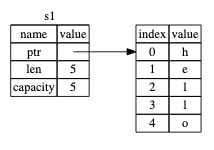
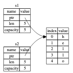

# What Is Ownership?

## Ownership Rules
1. rust 의 각각의 값은 해당 값ㄹ의 `owner`라고 불리는 변수를 가지고 있다.
2. 한번에 딱 하나의 `owner` 만 존재할 수 있다.
3. `owner가` 스코프 밖으로 벗어날 때 값은 `drop`된다

## Variable Scope

`scope`는 program 내에서 아이템이 유효함을 표시하기 위한 범위이다.

```rust
{                      // s는 유효하지 않습니다. 아직 선언이 안됐거든요.
    let s = "hello";   // s는 이 지점부터 유효합니다.

    // s를 가지고 뭔가 합니다.
}                      // 이 스코프는 이제 끝이므로, s는 더이상 유효하지 않습니다.
```

변수는 선언된 시점부터 현재의 `scope`가 끝날 때 까지 유효하다.
- `scope` 안에서 `s`가 등장하면, 유효
- 유효기간은 `scope` 밖으로 벗어날 때까지 지속


### Memory and Allocation
- 문자열 리터럴은 컴파일 타임에 내용을 알 수 있으므로 텍스트가 최종 실행파일에 하드코딩
- `String` 타입은 `heap`에 메모리를 할당하는 방식을 사용하기 때문에 텍스트 내용 및 크기를 변경 가능
  - 실행 중 메모리 할당자로부터 메모리를 요청해야 한다.
  - `String` 사용을 마쳤을 때 메모리를 해제할 방법이 필요하다.
    >rust  에서는 변수가 자신이 소속한 스코프를 벗어나는 순간 자동으로 메모리를 해제하는 방식 ( 다른 언어에서는 `GC`나 해제 시점을 명시해줘야 함)
```rust
    {
        let s = String::from("hello"); // s is valid from this point forward

        // do stuff with s
    }                                  // this scope is now over, and s is no
                                       // longer valid
```
- `s`가 스코프를 벗어 날 때 `drop`이라는 함수를 호출
- `drop`함수 내부에 개발자가 직접 메모리 해제 코드를 작성해 넣을 수 있다.
- `}`가 나타나는 지점에서 자동으로 호출된다.

### Variables and Data Interacting with Move

```rust
    let s1 = String::from("hello");
    let s2 = s1;
```
- `String`은 문자열 내용이 들어 있는 메모리를 가리키는 포인터, 문자열 길이, 메모리 용량 세 부분으로 이루어져 있다.
- 데이터는 `stack`에 저장되며, 문자열의 내용은 `heap`에 저장된다.




`s2`에 `s1`를 대입하면 `String`데이터가 복사된다, 포인터가 가리키는 힙 영역의 데이터는 복사되지 않는다.




`s2`와 `s1`이 같은 곳을 가리키기 때문에 `drop`함수가 각각 호출되어 메모리를 해제하게 되면 중복 해제 오류가 발생하기 때문에`let s2 = s1;` 라인 뒤로는 `s1`이 더디상 유효하지 않다고 판단한다.
```rust
    let s1 = String::from("hello");
    let s2 = s1;

    println!("{}, world!", s1);
```

`s2`가 생성된 이후에 `s1`에 접근하면 `runtime error`가 발생한다.
rust 에서는 이와 같이 대입 연산을 호출 햇을 때 기존의 변수를 무효화하기 때문에 복사가 아닌 이동이라고 표현한다.
